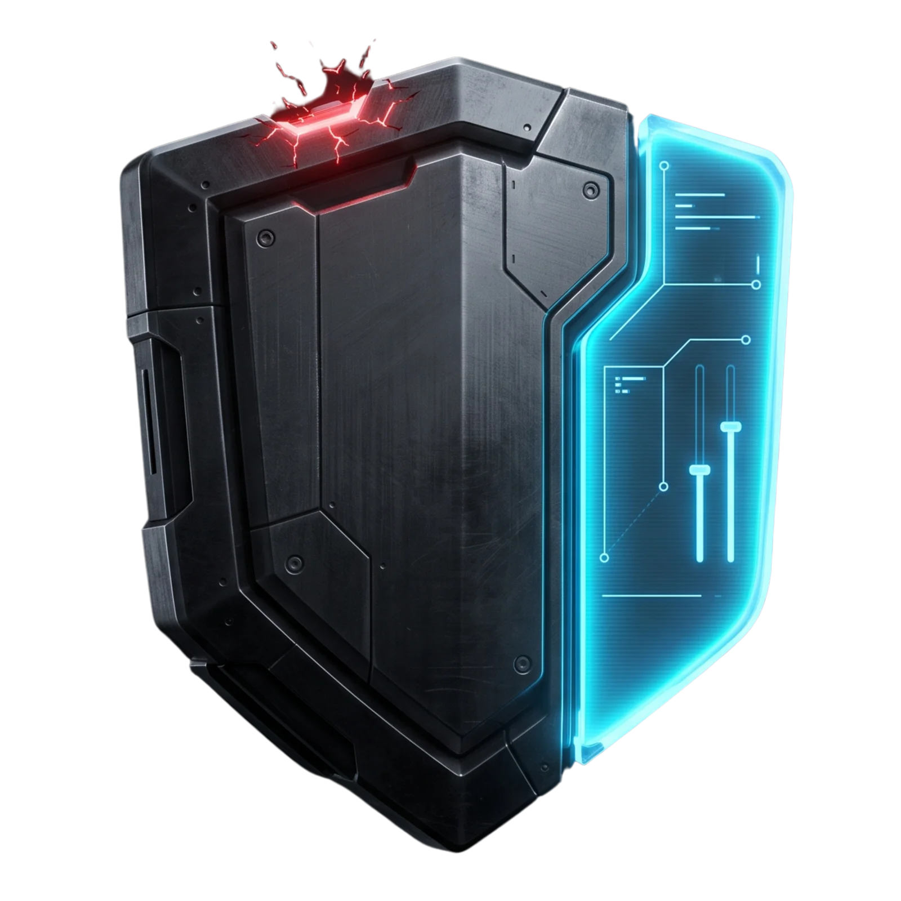

<div align="center">



# caddy-waf-ui

> Sidecar management UI for [caddy-waf](https://github.com/Developmi/caddy-waf).  
> Per-site WAF mode, CRS exclusions, IP rules, and rollback - without touching your base Caddyfile.

[](./LICENSE)
[](https://go.dev)
[]()
[]()
[]()
[]()
[]()

</div>

---

## Table of Contents

- [Overview](#overview)
- [Prerequisites](#prerequisites)
- [Quick Start](#quick-start)
- [Architecture](#architecture)
- [Docker deployment](#docker-deployment)
- [Configuration](#configuration)
- [Tests](#tests)
- [Features](#features)
- [Security Model](#security-model)
- [Ansible Integration](#ansible-integration)
- [Integration Contract](./INTEGRATION.md)
- [Rollback](#rollback)
- [Roadmap](#roadmap)
- [Security](#security)
- [Changelog](#changelog)
- [Contributing](#contributing)
- [License](#license)
- [Contact & support](#contact--support)

---

## Overview

`caddy-waf-ui` is a self-hosted sidecar that runs alongside your `caddy-waf` container and exposes a minimal web UI to manage WAF behavior at runtime - without requiring access to your Ansible inventory, vault, or base Caddyfile.

**It does NOT replace Ansible.** Your base Caddyfile remains Ansible-owned and immutable from the UI's perspective. The UI writes exclusively to a dedicated `ui-managed/` volume that Caddy imports as an overlay.

```
Internet → Caddy (base Caddyfile, Ansible-owned, :ro)
                └── per-slug overlay imports from ui-managed/ (INTEGRATION.md §5)  ← UI writes here only
                         ↑
                   caddy-waf-ui (sidecar, :rw on ui-managed only)
```

### What you can do from the UI

- Toggle `SecRuleEngine` per site (DetectionOnly / On / Off)
- Add/remove CRS exclusions per site (by rule ID, tag, or URI+param)
- Manage IP allowlist and denylist per site
- View and search recent Coraza detection logs
- Exclude rules from the per-domain exclusions page (one-click tuning from logs is planned)
- Rollback any site config to a previous snapshot

> **MVP status:** implemented today: WAF mode toggle, CRS exclusions (by ID, tag, or URI+param), IP rules, log viewer, and rollback.
> Planned: one-click exclusion from log entries, Cloudflare token management, SSE log streaming.

---

## Prerequisites

- Docker 24.x+ and Docker Compose v2.x+
- the `caddy-waf` stack v3.3.x+ (image `ghcr.io/developmi/caddy-waf`) running with `caddy_admin_enabled: true` - note: the WAF stack and this UI have independent version lines
- Caddy Admin API reachable at `caddy:2019` (Docker internal network only)
- Tailscale or equivalent for UI access (UI binds to `0.0.0.0:8080` by default)

---

## Quick Start

> Three-repo deployment contract (mounts, admin API, per-slug imports, emergency/drift procedures): see [INTEGRATION.md](./INTEGRATION.md).

### 1. Add the per-slug import directives to your Caddyfile

In your `Caddyfile.j2` (Ansible template), add at the end of each **UI-managed** site block, in this order - `ip-rules` first, then `waf`:

```caddyfile
{{ svc.domain }} {
    import /etc/caddy/ui-managed/ip-rules-{{ svc.domain | replace('.', '_') }}.conf
    import /etc/caddy/ui-managed/waf-{{ svc.domain | replace('.', '_') }}.conf
    ...
}
```

Do **not** `import waf` in managed blocks (the overlay embeds its own `coraza_waf` - a second engine breaks the reload), and do **not** use a glob (`*.conf`): a specific import whose file is missing **hard-fails Caddy startup**, so Ansible must pre-create empty placeholder files before first boot. Exclusions are never imported from the Caddyfile - they enter via the Coraza internal `Include` inside the overlay. See [INTEGRATION.md](./INTEGRATION.md) §5 for the full contract.

### 2. Provide runtime variables (without hard dependency on .env)

```bash
# Option A (local convenience):
cp .env.example .env
chmod 600 .env
# Edit .env - set CADDY_UI_TOKEN and CADDY_ADMIN_URL

# Option B (recommended for remote/prod):
export CADDY_UI_TOKEN="<secret>"
export CADDY_ADMIN_URL="http://caddy-waf:2019"
```

### 3. Add the sidecar to your compose

```yaml
# In your existing docker-compose.yml, add:
  caddy-waf-ui:
    # Tag v1.0.0 exists, and the build-scan-sign pipeline signs (keyless
    # cosign) and publishes to ghcr.io/developmi/caddy-waf-ui whenever a v*
    # tag is pushed - publication is at the maintainer's discretion. Pin an
    # immutable digest in production (SECURITY.md: never `:latest`). Building
    # from source stays the dev path (same as this repo's docker-compose.yml).
    build: .
    container_name: caddy-waf-ui
    restart: unless-stopped
    ports:
      - "127.0.0.1:8080:8080"
    networks:
      - public_net
    volumes:
      - caddy-ui-config:/ui-managed:rw
      - caddy-ui-backups:/backups:rw
    environment:
      - CADDY_UI_TOKEN=${CADDY_UI_TOKEN:-}
      - CADDY_ADMIN_URL=${CADDY_ADMIN_URL:-http://caddy-waf:2019}
      - CADDY_UI_CADDYFILE=${CADDY_UI_CADDYFILE:-/etc/caddy/Caddyfile}
      - CADDY_UI_MANAGED_DIR=${CADDY_UI_MANAGED_DIR:-/ui-managed}
      - CADDY_UI_INCLUDE_DIR=${CADDY_UI_INCLUDE_DIR:-/etc/caddy/ui-managed}
      - CADDY_UI_BACKUP_DIR=${CADDY_UI_BACKUP_DIR:-/backups}
      - CADDY_UI_BACKUP_KEEP=${CADDY_UI_BACKUP_KEEP:-10}
      - CADDY_UI_BIND=${CADDY_UI_BIND:-0.0.0.0:8080}
      - CADDY_UI_LOG_LEVEL=${CADDY_UI_LOG_LEVEL:-info}
      - CADDY_UI_AUDIT_LOG=${CADDY_UI_AUDIT_LOG:-/data/logs/coraza-audit.log}
    depends_on:
      - caddy

volumes:
  caddy-ui-config:
  caddy-ui-backups:
```

Then mount the shared volume on Caddy (`:ro`):

```yaml
  caddy:
    volumes:
      # ... existing volumes ...
      - caddy-ui-config:/etc/caddy/ui-managed:ro   # ← add this line
```

### 4. Start

```bash
docker compose up -d caddy-waf-ui
```

On a **fresh environment** (first start, or after `docker compose down -v`), the one-shot `ui-config-init` service creates the overlay files that the Caddyfile imports before Caddy starts - idempotent, it never overwrites existing configs (existing domains/apps keep their runtime overlays). It runs as `uiuser` (same uid as the UI), so the UI can always overwrite them later.

> The stack boots from a clean volume with **no manual steps**: `docker compose up -d`. If you add new UI-managed domains to the Caddyfile later, `docker compose run --rm ui-config-init` recreates their missing overlays.

Access the UI at `http://127.0.0.1:8080` (or via your Tailscale IP).

---

## 🏗️ Architecture

Single static Go binary (standard library only, no runtime dependencies). The UI runs as a sidecar next to `caddy-waf`, owns a dedicated `ui-managed/` overlay volume, and talks to Caddy exclusively through the Admin API (`POST /load` + read-back verification). The full design, data flow, and the three-repo deployment contract live in [ARCHITECTURE.md](./ARCHITECTURE.md) and [INTEGRATION.md](./INTEGRATION.md).

```
caddy-waf-ui/
├── cmd/server/          # entrypoint: env config, wiring, HTTP server
├── internal/
│   ├── auth/            # bearer token + cookie-session auth, HMAC-CSRF
│   ├── caddy/           # Caddy Admin API client, reload, read-back verify
│   ├── domain/          # site config model (slug, overlay generation)
│   ├── files/           # atomic writes, snapshots, retention
│   ├── iprules/         # IP allow/deny rule rendering
│   ├── logs/            # structured JSON logging + Coraza audit reader
│   ├── service/         # shared chain: validate → backup → generate → write → reload → audit
│   ├── ui/              # SSR pages (html/template + go:embed), PRG forms
│   └── waf/             # WAF mode / CRS exclusion rendering
└── tests/integration/   # end-to-end API + SSR tests against a live stack
```

Request flow: `Browser → UI (auth + CSRF) → internal/service chain → ui-managed/ overlay → POST /load → read-back verify → audit log`.

---

## 🐳 Docker deployment

Multi-stage build (builder → runtime), non-root `uiuser`, pinned base images (`golang:1.26.6-alpine`, `alpine:3.23.5`) - never `:latest`. Tag `v1.0.0` exists, and the `docker-build-scan-sign` workflow builds, scans, signs (keyless cosign) and publishes to `ghcr.io/developmi/caddy-waf-ui` **only when a `v*` tag is pushed** - the published image appears at the maintainer's discretion, not automatically. Until then, build from source:

```bash
docker build -t caddy-waf-ui:local .
```

The repo's `docker-compose.yml` wires the UI into the `caddy-waf` stack with shared volumes:

```bash
docker compose up -d caddy-waf-ui
```

> **Security callout:** the UI runs as a non-root user (`uiuser`) with write access **only** to the `ui-managed/` and `/backups` volumes; Caddy mounts `ui-managed/` read-only; the UI port is published on `127.0.0.1` only; the Caddy Admin API is never exposed to the host.
>
> **Token handling:** `CADDY_UI_TOKEN` in `.env` is **dev-only**. In production, inject it from the orchestrator's secret manager (e.g. `environment: CADDY_UI_TOKEN=${CADDY_UI_TOKEN}` with the value sourced outside the repo) or Docker secrets - never commit it in `.env` files.
>
> **Non-numeric `USER uiuser` (hadolint DL3066) is accepted by design:** the user is created with `adduser -D` in the image, and its uid is the deterministic `1000` - the exact uid the named volumes (`ui-managed`, `backups`) are initialized with, so the contract holds on any host. Switching to a numeric `USER 1000` would break reproducibility across images (uid is not guaranteed stable across Alpine releases) without adding security.

---

## Configuration

All configuration is via environment variables. No config file, no database.

| Variable | Required | Default | Description |
|---|---|---|---|
| `CADDY_UI_TOKEN` | ✅ | - | Bearer token for UI authentication |
| `CADDY_ADMIN_URL` | ✅ | `http://caddy-waf:2019` | Caddy Admin API endpoint |
| `CADDY_UI_CADDYFILE` | | `/etc/caddy/Caddyfile` | Caddyfile read by reload and sent to `POST /load` as `text/caddyfile` |
| `CADDY_UI_MANAGED_DIR` | | `/ui-managed` | Path inside container where UI writes configs |
| `CADDY_UI_INCLUDE_DIR` | | `/etc/caddy/ui-managed` | Caddy-side view of the overlay dir, referenced by the generated `Include` directive (must match the mount point inside the Caddy container) |
| `CADDY_UI_BACKUP_DIR` | | `/backups` | Path inside container for snapshots |
| `CADDY_UI_BACKUP_KEEP` | | `10` | Number of snapshots to retain per domain |
| `CADDY_UI_BIND` | | `0.0.0.0:8080` | UI listen address |
| `CADDY_UI_LOG_LEVEL` | | `info` | Log verbosity: `debug`, `info`, `warn`, `error` |
| `CADDY_UI_AUDIT_LOG` | | `/data/logs/coraza-audit.log` | Coraza audit log path read by the log viewer |

### .env.example

```env
# --- UI Authentication ---
# Bearer token for UI authentication (generate with: openssl rand -hex 32)
#
# DEV-ONLY: this file is optional convenience for local runs and stores the
# token in plaintext. For production, do NOT put the token in .env - inject it
# from the orchestrator's secret manager via env interpolation instead, e.g.:
#   environment:
#     - CADDY_UI_TOKEN=${CADDY_UI_TOKEN}   # sourced from the secret manager,
#                                          # never committed, never in .env
# or use Docker secrets mounted to a file (the UI reads CADDY_UI_TOKEN as env).
CADDY_UI_TOKEN=change-me-generate-with-openssl-rand-hex-32

# --- Caddy Admin API (internal Docker network only) ---
CADDY_ADMIN_URL=http://caddy-waf:2019

# --- Caddyfile reload ---
# Caddyfile read by reload and sent to POST /load as text/caddyfile (10s timeout).
# If unset, defaults to /etc/caddy/Caddyfile.
CADDY_UI_CADDYFILE=/etc/caddy/Caddyfile

# --- Paths (match your volume mounts) ---
CADDY_UI_MANAGED_DIR=/ui-managed
# Caddy's view of the overlay volume: the Include directive of the generated
# overlays references it. Must match the mount point inside the Caddy
# container (see INTEGRATION.md §3).
CADDY_UI_INCLUDE_DIR=/etc/caddy/ui-managed
CADDY_UI_BACKUP_DIR=/backups
CADDY_UI_BACKUP_KEEP=10

# --- Runtime ---
# Listen address (restrict to loopback or Tailscale interface)
CADDY_UI_BIND=0.0.0.0:8080
# Structured JSON log level (debug, info, warn, error) - fail-safe: info
CADDY_UI_LOG_LEVEL=info
# Coraza audit log path read by the log viewer
CADDY_UI_AUDIT_LOG=/data/logs/coraza-audit.log

# --- Compose stack (optional - consumed by docker-compose.yml for caddy-waf) ---
ACME_EMAIL=admin@example.com
SITE_ADDRESS=localhost
BACKEND_UPSTREAM=example-app:80
CADDY_WAF_IMAGE=ghcr.io/developmi/caddy-waf:v3.3.2
EXAMPLE_APP_IMAGE=containous/whoami:v1.5.0
```

---

## 🧪 Tests

Unit tests cover the service chain, overlay generation, auth (constant-time compare, sessions, CSRF), the Caddy Admin client (including read-back verification), atomic file writes, snapshot retention, and the audit-log reader. Integration tests in `tests/integration/` exercise the REST API and SSR pages against a live stack.

```bash
go test -race ./...     # full suite with race detector
go vet ./...            # static checks
go test -cover ./...    # coverage report
make release-ready      # full pre-push gate (see CONTRIBUTING.md)
```

> CI runs three workflows on every PR against `main`: **lint** (golangci-lint, yamllint, actionlint, hadolint, zizmor), **test** (vet, race-detector tests, build, compose validation), and **build-scan-sign** (multi-arch build + Trivy gate with `vuln,secret,misconfig` scanners and SARIF upload). [Dependabot](.github/dependabot.yml) keeps gomod, Docker and GitHub Actions dependencies up to date (weekly, `chore(deps)` commits). The local pre-push gate `make release-ready` (fmt, vet, lint, vuln, test-race, compose-config, build, docker-build) mirrors what CI enforces - it is the merge gate (see [CONTRIBUTING.md](./CONTRIBUTING.md)). On `v*` tag pushes, build-scan-sign additionally pushes the multi-arch image to GHCR with SBOM, keyless cosign signature, and SLSA provenance.

---

## Features

### WAF Mode Toggle (per site)

Each domain managed by the UI gets its own file:

```
/ui-managed/waf-{domain}.conf
```

Content example:

```caddyfile
# Caddy WAF UI managed - do not edit manually
# domain: api.example.com | mode: On | updated: 2026-07-22T14:00:00Z
coraza_waf {
    directives `
        Include /etc/caddy/coraza.conf
        Include /etc/caddy/owasp-crs/crs-setup.conf
        Include /etc/caddy/owasp-crs/rules/*.conf
        SecRuleEngine On
        Include /etc/caddy/ui-managed/exclusions-api_example_com.conf
        SecAuditEngine RelevantOnly
        SecAuditLog /data/logs/coraza-audit.log
        SecAuditLogFormat JSON
        SecAuditLogParts ABCDEFGHIJKZ
    `
}
```

The overlay is an inline `coraza_waf { ... }` block (no named snippet wrapper), directly importable inside site blocks. The `# domain: | mode: | updated:` header is the machine-readable contract consumed by the domain scanner; the `Include` path comes from `CADDY_UI_INCLUDE_DIR`.

### CRS Exclusions (per site)

Exclusions are written to `/ui-managed/exclusions-{domain}.conf`. Three operation types are supported: by rule ID, by tag, and by URI + parameter.

```
# By rule ID
SecRuleRemoveById 941100

# By tag
SecRuleRemoveByTag "attack-xss"

# By URI + parameter
SecRule REQUEST_URI "@beginsWith /api/v1/content" \
    "id:9000001,phase:2,pass,nolog,ctl:ruleRemoveTargetById=942100;ARGS:body"
```

Exclusions are managed on the per-domain **exclusions page** - a catalog of common OWASP CRS rules plus a custom directive form, submitted via `POST /sites/{domain}/exclusions` (by rule ID, tag, or URI + parameter). One-click exclusion from a log entry is **planned - not implemented in MVP**.

### IP Rules (per site)

Written to `/ui-managed/ip-rules-{domain}.conf`. Processed by Caddy before WAF - zero WAF overhead on blocked traffic.

```caddyfile
# Denylist
@ip_deny_api_example_com {
    remote_ip 1.2.3.4/32 10.0.0.0/8
}
abort @ip_deny_api_example_com

# Allowlist (if set, all other IPs are denied)
@ip_allow_api_example_com {
    not remote_ip 203.0.113.0/24 198.51.100.5/32
}
abort @ip_allow_api_example_com
```

### Log Viewer

Reads (bounded tail) from `/data/logs/coraza-audit.log` (shared volume, read-only access for the UI). Filterable by:

- Domain
- Rule ID
- Severity
- Action (detected / blocked)
- Time range

Each entry shows the trigger details as columns - timestamp, action (DETECTED / BLOCKED), rule ID, client IP, and URI:

```
2026-07-22 14:32:11  BLOCKED  941100  203.0.113.7  GET /search?q=<script>
```

Inline exclusion actions on log entries (Add Exclusion / View Rule / Block IP) are **planned - not implemented in MVP**; exclusions are added from the per-domain exclusions page instead.

### Cloudflare Token (planned - not implemented in MVP)

The stored token is:

- Never logged
- Shown in the UI as `••••••••••••abcd` (last 4 chars only)
- Updatable through the UI (writes back to `.env`, triggers sidecar restart)

---

## Security Model

| Control | Implementation |
|---|---|
| **AC-3** - Access control | Bearer token auth on all UI routes; Admin API never exposed beyond Docker network |
| **AC-4** - Info flow | UI writes only to `ui-managed/` volume; base Caddyfile mounted `:ro` |
| **AU-12** - Audit logging | All UI actions logged to stdout in JSON with actor, timestamp, action, domain |
| **CSP** - Browser content security | `Content-Security-Policy` on every response (`default-src 'self'`); assets self-hosted and embedded in the binary (Pico CSS v2.1.1 pinned, no CDN); no inline scripts or styles |
| **SC-8** - Transmission security | UI binds to `0.0.0.0:8080` by default; host exposure restricted via compose port mapping, external access via Caddy+mTLS if needed |
| **SC-28** - Protection at rest | `.env` permissions enforced at `600`; token never stored in config files |
| **SI-4** - Monitoring | Log viewer surfaces WAF detections (implemented); one-click exclusion path discourages disabling (planned) |
| **CM-3** - Config change control | Every write creates a snapshot before applying; UI rollback implemented (snapshot restore + reload) |

### Threat model

The UI assumes the **Docker network is trusted** (same compose stack). If Caddy itself is compromised, the Admin API is accessible - this is a known tradeoff for the hot-reload capability. Mitigations:

- Admin API is **localhost-only** within Docker (`caddy:2019`, not exposed to host)
- The UI container has **no access to certs, base Caddyfile, or Ansible vault**
- All writes are **audited** and **reversible**
- `ui-managed/` isolation limits blast radius to runtime WAF overrides only

---

## Ansible Integration

The only required change to your Ansible roles is:

**`group_vars/all/caddy.yml`**

```yaml
# Enable Admin API when caddy-waf-ui is present on this node
caddy_admin_enabled: "{{ caddy_ui_enabled | default(false) }}"
```

**`host_vars/{node}.yml`** (per node that runs the UI)

```yaml
caddy_ui_enabled: true
```

**`Caddyfile.j2`** - add one line to each site block:

```jinja
{{ svc.domain }} {
    import /etc/caddy/ui-managed/ip-rules-{{ svc.domain | replace('.', '_') }}.conf
    import /etc/caddy/ui-managed/waf-{{ svc.domain | replace('.', '_') }}.conf
    ...
}
```

Managed blocks never `import waf` (the overlay embeds its own `coraza_waf`). The slug is `domain.DomainSlug(domain)` - lowercase, `.` → `_`, `*` → `wildcard`, `-` → `_` - and Ansible must pre-create empty placeholders for both files before first boot (a specific import that is missing hard-fails Caddy startup). Exclusions are reached via the Coraza internal `Include` inside the overlay, never via the Caddyfile. See [INTEGRATION.md](./INTEGRATION.md) §5.

Ansible never writes to `ui-managed/`. The volume is owned exclusively by `caddy-waf-ui`. Subsequent `ansible-playbook` runs update the base Caddyfile only - they do not affect UI-managed overrides.

---

## Rollback

Before every write, the UI snapshots the current state:

```
/backups/{domain}/
    ├── 2026-07-22T14-00-00Z.conf
    ├── 2026-07-22T13-45-00Z.conf
    └── ... (up to CADDY_UI_BACKUP_KEEP snapshots)
```

Rolling back:

1. Select domain → History tab
2. View diff between current and snapshot
3. Click Rollback → UI writes snapshot + calls `POST /load` on Caddy Admin API
4. Snapshot of the pre-rollback state is saved first (rollback is itself reversible)

---

## Roadmap

| Version | Feature |
|---|---|
| v1.0.0 | WAF mode toggle, CRS exclusions, IP rules, log viewer, rollback |
| v1.1.0 | Bulk exclusion import/export (JSON) |
| v2.0.0 | Paranoia Level tuning per site |
| v2.1.0 | Rate limit config via UI (`caddy-ratelimit`) |
| v2.2.0 | Dashboard - top triggered rules, blocked requests, per-site metrics |
| v2.3.0 | WebSocket bypass toggle per site |
| v3.0.0 | Config export as Ansible-compatible YAML (vault-ready) |

---

## 🔒 Security

This project follows a **coordinated disclosure** policy.
If you discover a vulnerability, **do not open a public issue**.
See [SECURITY.md](./SECURITY.md) for reporting instructions, response timelines, and the accepted residual risk on the Caddy Admin API channel.

---

## 📋 Changelog

See [CHANGELOG.md](./CHANGELOG.md) for the full version history.
The project follows [Keep a Changelog](https://keepachangelog.com/) and [Semantic Versioning](https://semver.org/).

---

## Contributing

Contributions are welcome. Read [CONTRIBUTING.md](./CONTRIBUTING.md) before opening a PR.  
This project follows [Conventional Commits](https://www.conventionalcommits.org/) and the Developmi engineering standard.

---

## License

Copyright © 2026 Miguel Lozano | Developmi.  
Licensed under the [MIT License](./LICENSE).

---

## 🤝 Contact & support

**Maintained by:** Miguel Lozano | Developmi

- **Role:** Cloud & Infrastructure Engineer | FinOps & Bare Metal Specialist
- **Philosophy:** _Security is not a feature; it is the baseline._
- **Website:** [developmi.com](https://developmi.com)
- **GitHub:** [Miguel Lozano](https://github.com/Miguel-DevOps)
- **LinkedIn:** [Miguel Lozano](https://www.linkedin.com/in/miguel-dev-ops)

---

© 2026 Miguel Lozano | Developmi. All rights reserved.
