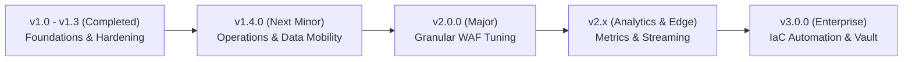

# Roadmap - caddy-waf-ui

This document outlines the evolutionary direction, planned milestones, and architectural roadmap for `caddy-waf-ui`.

The project adheres to strict **Go standard-library purity** (zero third-party Go runtime dependencies), minimal attack surface, least-privilege containerization, and seamless 1:1 integration with [caddy-waf](https://github.com/Developmi/caddy-waf) and Ansible-managed infrastructure.

---

## 🧭 Milestone Overview

---

## 📌 Status & Milestones

### ✅ Completed Milestones

| Version | Milestone Scope | Delivered Features |
|---|---|---|
| **v1.0.0** | Core Foundation | Initial web UI sidecar, WAF mode toggle (`On` / `DetectionOnly` / `Off`), CRS rule exclusion management, IP allow/block lists, basic Coraza JSONL log viewer, snapshot rollbacks (`internal/caddy`, `internal/waf`, `internal/iprules`, `internal/logs`). |
| **v1.1.x** | Standards & CI Alignment | Standardized 100% English code/docs/UI copy, decoupled least-privilege CI/CD with Cosign OCI keyless signing, SLSA Level 3 provenance attestations, and Trivy automated vulnerability gates. |
| **v1.2.0** | Perimeter Hardening & Coverage | Perimeter security headers, defense-in-depth `@sensitive_paths` block, unit/statement test coverage raised above 92% across all internal packages with HTTP streaming passthrough coverage. |
| **v1.3.0** | Upstream Parity & Concurrency Safety | Aligned with upstream `caddy-waf:v3.6.0` (Caddy 2.11.7, CRS v4.30.0, Alpine 3.24.2 with pinned packages), wildcard domain support (`*.domain.tld`), service mutation mutex (`chainMu`) preventing reload races, client IP extraction fix in rate limiters (`net.SplitHostPort`), and CSP baseline headers. |

---

### 🚀 Upcoming Milestones

#### 📦 v1.4.0 — Operational Reliability & Data Mobility

Focused on operational ergonomics, bulk data portability, and audit resilience without introducing external dependencies.

- [ ] **Audit Log Auto-Rotation & Pruning (`internal/logs`)**:
  - Implement size-based threshold rotation (configurable via `CADDY_UI_LOG_ROTATE_SIZE_MB`, default `32MB`) with retention window (`CADDY_UI_LOG_MAX_BACKUPS`, default `5`).
  - Graceful streaming tailing that handles inode rotation without dropping events.
- [ ] **Bulk Rule & Exclusion Import/Export (JSON)**:
  - Export active per-domain exclusions and IP rules to portable JSON schema.
  - Idempotent import validation with schema verification and dry-run syntax checks prior to disk write.
- [ ] **Opt-in Live Caddy Binary Integration Suite**:
  - Add optional test runner flag (`CADDY_TEST_BINARY`) to execute real end-to-end reload and Coraza rule verification against an embedded Caddy runtime in CI.
- [ ] **Session Expiry & Explicit Logout Timeout**:
  - Enforce explicit inactivity timeouts (≤ 15 minutes, aligning with NIST AC-12 and CIS 4.3).

---

#### 🛡️ v2.0.0 — Granular WAF & Coraza Engine Tuning

Focused on fine-tuning the Coraza WAF engine posture on a per-site basis.

- [ ] **Paranoia Level (PL 1–4) Per Site**:
  - UI control and overlay generator for `SecAction "id:900000,phase:1,nolog,pass,t:none,setvar:tx.paranoia_level=X"`.
  - Visual indicators displaying risk profile and false-positive potential per paranoia tier.
- [ ] **Anomaly Threshold Configuration**:
  - Custom inbound/outbound anomaly score thresholds per domain (`tx.inbound_anomaly_score_threshold`).
- [ ] **CIDR & Subnet Range Matching (`internal/iprules`)**:
  - Support high-performance IP range matching (`/24`, `/16`, IPv6 `/64`) using sorted radix-tree or binary search over standard library `net/netip`.
- [ ] **High-Impact Action Re-Authentication**:
  - Password or token confirmation prompt before destructive actions (full domain purge, global WAF disable, mass IP unblock).

---

#### 📊 v2.x — Metrics, Analytics & Traffic Control

- [ ] **v2.1.0 — UI Rate Limiting Management**:
  - UI configuration overlay for `caddy-ratelimit` directives per domain and path.
- [ ] **v2.2.0 — Security Observability Dashboard**:
  - Real-time aggregated metrics: Top triggered CRS rules, top blocked client IPs, geographic/path distribution, and attack trend visualization.
- [ ] **v2.3.0 — Protocol Specific Bypasses**:
  - WebSocket bypass toggles per site (`@websocket` matcher exclusion).
- [ ] **Append-Only Audit Forwarding**:
  - Optional syslog/RFC 5424 stream forwarding or webhook dispatcher for immutable remote log preservation outside operator reach (NIST AU-11, AU-12).

---

#### 🏢 v3.0.0 — Enterprise IaC & Automation

- [ ] **Ansible & Vault Export Pipeline**:
  - Export runtime overlay state into Ansible-compatible YAML structures (`caddy_managed_sites.yml`), ready for direct inclusion in GitOps inventories.
- [ ] **mTLS Admin API Client Authentication**:
  - Support mutual TLS (`X.509` client certificates) for the Caddy Admin API (`CADDY_ADMIN_URL`), eliminating reliance on network-only perimeter trust (cross-project contract NIST SC-7, AC-3).

---

## 🚫 Explicitly Out of Scope

To preserve the lean security model and supply chain integrity of `caddy-waf-ui`, the following are **deliberately out of scope**:

1. **Third-Party Go Runtime Dependencies**:
   - The Go codebase remains 100% standard library. No external database drivers, ORMs, or web frameworks will be added.
2. **Proprietary/Closed Binary Rule Formats**:
   - Compiling or interpreting foreign proxy-specific binary rule formats (e.g. sing-box `.srs`) within the sidecar is out of scope. Standard OWASP CRS rules and plain text CIDR lists are supported.
3. **Direct Mutation of the Base Caddyfile**:
   - The UI will never write to the root Caddyfile or manage TLS certificates; GitOps owns site identity and baseline configuration ([INTEGRATION.md](./INTEGRATION.md)).
